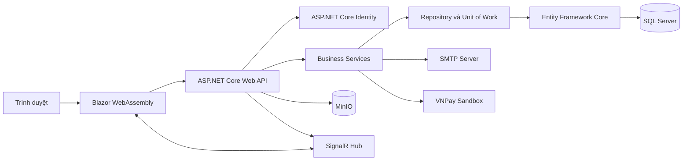
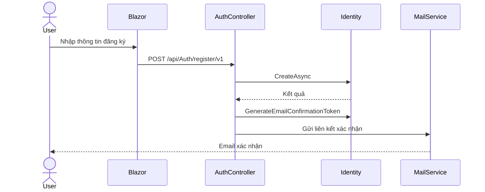
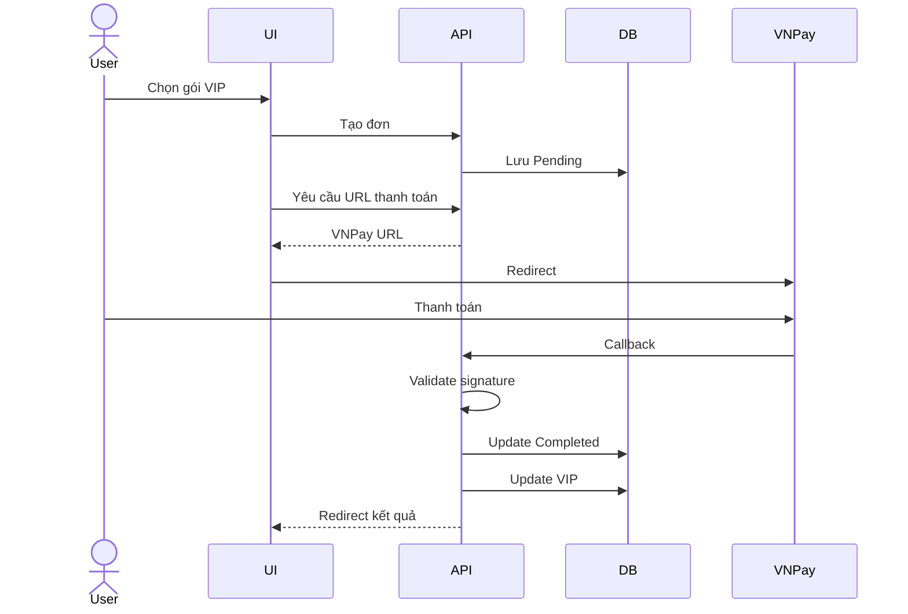

# Hướng dẫn chi tiết dự án PRN222 Course Management

> Tài liệu kỹ thuật, vận hành, kiểm thử và bàn giao dành cho dự án quản lý khóa học trực tuyến.

---

## 1. Thông tin tài liệu

| Thuộc tính | Giá trị |
|---|---|
| Tên dự án | PRN222 Course Management |
| Loại hệ thống | Nền tảng quản lý và học khóa học trực tuyến |
| Backend | ASP.NET Core Web API |
| Frontend | Blazor WebAssembly |
| Framework | .NET 8 |
| ORM | Entity Framework Core 8 |
| Database | Microsoft SQL Server |
| Authentication | ASP.NET Core Identity và JWT |
| Object Storage | MinIO qua giao thức S3 |
| Realtime | SignalR |
| Thanh toán | VNPay Sandbox |
| Email | SMTP |
| Mục đích tài liệu | Hướng dẫn phát triển, chạy, kiểm thử, demo và bảo trì |

### 1.1 Đối tượng đọc

Tài liệu này phù hợp với:

- Thành viên mới tham gia dự án.
- Sinh viên cần hiểu kiến trúc bài tập PRN222.
- Người phụ trách backend.
- Người phụ trách Blazor frontend.
- Người kiểm thử phần mềm.
- Người chuẩn bị demo.
- Người triển khai hệ thống.
- Người bảo trì mã nguồn.
- Giảng viên hoặc reviewer cần đọc nhanh luồng hệ thống.

### 1.2 Cách sử dụng tài liệu

Nếu lần đầu chạy dự án:

1. Đọc phần tổng quan.
2. Đọc phần yêu cầu môi trường.
3. Chạy SQL Server và MinIO.
4. Cấu hình API.
5. Restore package.
6. Chạy migration.
7. Chạy API.
8. Chạy Blazor.
9. Kiểm tra Swagger.
10. Thực hiện checklist smoke test.

Nếu cần sửa một chức năng:

1. Tìm module nghiệp vụ tương ứng.
2. Kiểm tra DTO.
3. Kiểm tra repository.
4. Kiểm tra business service.
5. Kiểm tra controller.
6. Kiểm tra Blazor client.
7. Kiểm tra phân quyền.
8. Viết hoặc cập nhật test case.
9. Build lại toàn solution.
10. Kiểm tra hồi quy.

---

## 2. Tổng quan sản phẩm

PRN222 Course Management là một ứng dụng web hỗ trợ:

- Quản lý tài khoản.
- Đăng ký tài khoản.
- Đăng nhập.
- Xác nhận email.
- Quên mật khẩu.
- Đổi mật khẩu.
- Phân quyền User và Admin.
- Quản lý danh mục.
- Quản lý khóa học.
- Quản lý module.
- Quản lý bài học.
- Quản lý tài liệu bài học.
- Xem trước khóa học.
- Đăng ký khóa học.
- Học nội dung video.
- Theo dõi tiến độ bài học.
- Ghi nhớ bài học gần nhất.
- Ghi chú cá nhân.
- Bình luận.
- Bình luận thời gian thực.
- Quản lý blog.
- Quản lý đơn hàng.
- Thanh toán VNPay.
- Nâng cấp tài khoản VIP.
- Gợi ý khóa học.
- So sánh khóa học.
- Dashboard tiến độ học tập.
- Dashboard phân tích dành cho Admin.

### 2.1 Tác nhân chính

#### Khách chưa đăng nhập

Khách có thể:

- Xem trang chủ.
- Xem danh sách khóa học công khai.
- Xem khóa học miễn phí và Pro.
- Xem trước thông tin khóa học.
- Xem bài blog đã xuất bản.
- So sánh khóa học.
- Nhận gợi ý khóa học không cá nhân hóa.
- Truy cập trang đăng ký.
- Truy cập trang đăng nhập.
- Thực hiện quên mật khẩu.

Khách không thể:

- Theo dõi tiến độ học tập.
- Ghi chú bài học.
- Đánh dấu bài hoàn thành.
- Truy cập dashboard cá nhân.
- Quản trị nội dung.
- Sử dụng endpoint yêu cầu JWT.

#### Người dùng đã đăng nhập

Người dùng có thể:

- Cập nhật hồ sơ.
- Đổi mật khẩu.
- Đăng ký khóa học.
- Học khóa học đã được phép truy cập.
- Đánh dấu bài học hoàn thành.
- Bỏ trạng thái hoàn thành.
- Lưu bài học gần nhất.
- Thêm ghi chú cá nhân.
- Xóa ghi chú cá nhân.
- Xem tài liệu bài học.
- Bình luận.
- Xem dashboard tiến độ.
- Nhận gợi ý có loại trừ khóa đã đăng ký.
- Tạo đơn hàng.
- Thanh toán nâng cấp VIP.

#### Người dùng VIP

Ngoài quyền của User, VIP có thể:

- Truy cập nội dung yêu cầu gói Pro.
- Duy trì quyền trong thời gian VIP còn hiệu lực.
- Xem ngày hết hạn VIP.
- Gia hạn thông qua luồng thanh toán.

#### Quản trị viên

Admin có thể:

- Quản lý người dùng.
- Gán vai trò.
- Xóa vai trò.
- Khóa hoặc ban tài khoản theo chức năng hiện có.
- Tạo danh mục.
- Cập nhật danh mục.
- Xóa danh mục khi không còn khóa học liên quan.
- Tạo khóa học.
- Cập nhật khóa học.
- Publish hoặc unpublish khóa học.
- Quản lý module.
- Sắp xếp module.
- Quản lý bài học.
- Sắp xếp bài học.
- Upload tài liệu.
- Xóa tài liệu.
- Quản lý blog.
- Duyệt hoặc thay đổi trạng thái blog.
- Quản lý đơn hàng.
- Xem dashboard phân tích.

---

## 3. Kiến trúc tổng thể

### 3.1 Sơ đồ logic



### 3.2 Các tầng chính

#### CourseManagement.Model

Chứa:

- Entity.
- DTO.
- ViewModel.
- Enum.
- Constant.
- Mail model.
- Response model.

Nguyên tắc:

- Không chứa truy vấn database.
- Không phụ thuộc API.
- Không phụ thuộc giao diện.
- DTO đầu vào cần validation.
- DTO đầu ra không để lộ dữ liệu nhạy cảm.

#### CourseManagement.DataAccess

Chứa:

- DbContext.
- Migration.
- Data seed.
- Generic repository.
- Specialized repository.
- Unit of Work.

Trách nhiệm:

- Truy vấn dữ liệu.
- Theo dõi entity.
- Lưu thay đổi.
- Quản lý transaction ở mức cần thiết.
- Thiết lập quan hệ EF Core.
- Tối ưu truy vấn.

#### CourseManagement.Business

Chứa:

- Business service.
- Service interface.
- Tích hợp email.
- Tích hợp VNPay.
- Tích hợp MinIO/S3.
- Gợi ý khóa học.
- So sánh khóa học.
- Dashboard học tập.
- Dashboard Admin.

Trách nhiệm:

- Thực thi quy tắc nghiệp vụ.
- Không phụ thuộc UI.
- Không trả IActionResult.
- Không đọc trực tiếp component Blazor.
- Có thể dùng repository hoặc DbContext tùy module hiện tại.

#### CourseManagementAPI

Chứa:

- Controller.
- Hub SignalR.
- Mapping profile.
- Cấu hình dependency injection.
- Swagger.
- CORS.
- Authentication.
- Authorization.
- Migration khi khởi động.
- Seed dữ liệu lịch sử.

Trách nhiệm:

- Nhận HTTP request.
- Kiểm tra model state.
- Đọc claim người dùng.
- Gọi business service hoặc repository.
- Trả HTTP status phù hợp.
- Không đặt quá nhiều nghiệp vụ trực tiếp trong controller.

#### BlazorAppSecure

Chứa:

- Razor page.
- Razor component.
- Layout.
- Client service.
- AuthenticationStateProvider.
- HTTP handler.
- CSS.
- Service worker.

Trách nhiệm:

- Hiển thị UI.
- Thu thập input.
- Gọi API.
- Hiển thị loading.
- Hiển thị error.
- Điều hướng.
- Ẩn hoặc hiện UI theo role.
- Không thay thế authorization phía server.

### 3.3 Luồng request tiêu chuẩn

```text
Người dùng
    ↓
Razor Component
    ↓
Typed Client hoặc HttpClient
    ↓
Custom HTTP Handler gắn Bearer Token
    ↓
API Controller
    ↓
Business Service
    ↓
Repository hoặc DbContext
    ↓
SQL Server
    ↓
DTO Response
    ↓
JSON
    ↓
Blazor UI
```

---

## 4. Cấu trúc solution

```text
PRN222_CourseManagement/
├── BlazorAppSecure/
│   ├── Component/
│   │   ├── Account/
│   │   ├── Blog/
│   │   ├── Courses/
│   │   ├── Manage/
│   │   ├── Orders/
│   │   └── Subscription/
│   ├── Layout/
│   ├── Model/
│   ├── Pages/
│   ├── Services hoặc Sevices/
│   ├── Shared/
│   ├── wwwroot/
│   ├── App.razor
│   └── Program.cs
├── CourseManagementAPI/
│   ├── Controllers/
│   ├── Data/
│   ├── Hubs/
│   ├── Mappings/
│   ├── Properties/
│   ├── Services/
│   ├── appsettings.json
│   └── Program.cs
├── CourseManagement.Business/
│   ├── Services/
│   └── CourseManagement.Business.csproj
├── CourseManagement.DataAccess/
│   ├── Data/
│   ├── Migrations/
│   ├── Repositorys/
│   └── CourseManagement.DataAccess.csproj
├── CourseManagement.Model/
│   ├── Constant/
│   ├── CustomResponses/
│   ├── DTOs/
│   ├── Mail/
│   ├── Model/
│   ├── ViewModel/
│   └── CourseManagement.Model.csproj
├── tools/
├── images/
├── docker-compose.yml
├── create_table.sql
├── database-schema.puml
├── system-design.puml
├── api-endpoints.puml
├── README.md
└── PRN222_CourseManagement.sln
```

### 4.1 Quy ước thư mục cần lưu ý

Trong repository hiện tại có thư mục tên `Sevices`.

Đây là spelling đang tồn tại trong frontend.

Khi thêm client service mới:

- Có thể tiếp tục dùng `Sevices` để tránh thay đổi lớn.
- Không nên vừa dùng `Services` vừa dùng `Sevices` trong cùng một module.
- Nếu refactor, cần cập nhật toàn bộ namespace.
- Phải build lại Blazor sau khi đổi namespace.

Trong Data Access có thư mục `Repositorys`.

Đây cũng là tên đang tồn tại.

Nếu refactor sang `Repositories`:

- Đổi folder.
- Đổi namespace.
- Đổi using.
- Đổi dependency injection.
- Build toàn solution.
- Kiểm tra migration không bị ảnh hưởng.

---

## 5. Công nghệ sử dụng

### 5.1 Backend

- C#.
- .NET 8.
- ASP.NET Core Web API.
- Entity Framework Core 8.
- SQL Server provider.
- ASP.NET Core Identity.
- JWT Bearer token.
- AutoMapper.
- Swagger.
- Swashbuckle.
- SignalR.
- AWS SDK for S3.
- MailKit.
- MimeKit.

### 5.2 Frontend

- Blazor WebAssembly.
- Razor Component.
- Ant Design Blazor.
- Bootstrap CSS.
- HttpClientFactory.
- AuthenticationStateProvider.
- SignalR Client.
- EPPlus.
- Blazored Text Editor.
- Service worker.

### 5.3 Hạ tầng cục bộ

- Docker Desktop.
- SQL Server 2022 container.
- MinIO container.
- HTTPS development certificate.
- SMTP Gmail hoặc SMTP tương thích.
- VNPay Sandbox.

---

## 6. Yêu cầu môi trường

### 6.1 Phần mềm bắt buộc

- Windows 10 hoặc Windows 11.
- .NET SDK 8.x.
- Git.
- Docker Desktop hoặc SQL Server local.
- Visual Studio 2022 hoặc Visual Studio Code.
- Trình duyệt Chrome, Edge hoặc Firefox.

### 6.2 Kiểm tra .NET SDK

```powershell
dotnet --info
```

Kỳ vọng:

- Có SDK 8.x.
- Runtime ASP.NET Core 8.x.
- Runtime .NET 8.x.

### 6.3 Kiểm tra workload Blazor

```powershell
dotnet workload list
```

Nếu thiếu:

```powershell
dotnet workload restore
```

Hoặc:

```powershell
dotnet workload install wasm-tools
```

### 6.4 Kiểm tra Docker

```powershell
docker --version
docker compose version
```

### 6.5 Kiểm tra cổng

Các cổng thường dùng:

| Dịch vụ | Cổng |
|---|---:|
| SQL Server | 1433 |
| MinIO S3 API | 9000 |
| MinIO Console | 9001 |
| Backend HTTPS | 7239 |
| Frontend HTTP | 5187 |
| Frontend HTTPS theo profile khác | 7195 |

Kiểm tra cổng trên Windows:

```powershell
Get-NetTCPConnection -State Listen |
    Where-Object LocalPort -In 1433,9000,9001,7239,5187,7195
```

---

## 7. Cài đặt dự án

### 7.1 Clone repository

```powershell
git clone <repository-url>
cd PRN222_CourseManagement
```

### 7.2 Kiểm tra branch

```powershell
git branch --show-current
git status
```

### 7.3 Restore package

```powershell
dotnet restore PRN222_CourseManagement.sln
```

Nếu máy có cấu hình NuGet fallback cũ:

```powershell
dotnet restore PRN222_CourseManagement.sln --force -p:RestoreFallbackFolders=
```

### 7.4 Build solution

```powershell
dotnet build PRN222_CourseManagement.sln
```

Build riêng API:

```powershell
dotnet build CourseManagementAPI/CourseManagementAPI.csproj
```

Build riêng Blazor:

```powershell
dotnet build BlazorAppSecure/BlazorAppSecure.csproj
```

### 7.5 Cảnh báo package

Khi restore, NuGet có thể hiển thị cảnh báo bảo mật.

Quy trình xử lý:

1. Ghi lại package.
2. Ghi lại advisory.
3. Xem package có bản vá hay chưa.
4. Đọc breaking changes.
5. Tạo branch cập nhật.
6. Nâng version.
7. Restore.
8. Build.
9. Chạy smoke test.
10. Chạy test hồi quy.

Không nên bỏ qua cảnh báo package trong môi trường production.

---

## 8. Chạy hạ tầng bằng Docker

### 8.1 Khởi động container

```powershell
docker compose up -d
```

### 8.2 Kiểm tra trạng thái

```powershell
docker compose ps
```

### 8.3 Xem log SQL Server

```powershell
docker logs coursemanagement-sqlserver
```

### 8.4 Xem log MinIO

```powershell
docker logs minio
```

### 8.5 Truy cập MinIO Console

Mở:

```text
http://localhost:9001
```

Tài khoản phát triển mặc định trong `docker-compose.yml`:

```text
Username: minioadmin
Password: minioadmin
```

Chỉ dùng thông tin này ở local.

Không dùng credential mặc định khi deploy.

### 8.6 Tạo bucket

Service file hiện sử dụng bucket:

```text
file
```

Các bước:

1. Đăng nhập MinIO Console.
2. Chọn Buckets.
3. Chọn Create Bucket.
4. Nhập `file`.
5. Giữ bucket private.
6. Tạo bucket.
7. Upload thử một file.
8. Kiểm tra API tạo presigned URL.

### 8.7 Dừng container

```powershell
docker compose down
```

### 8.8 Giữ dữ liệu

Lệnh `docker compose down` không xóa named volume.

Dữ liệu vẫn nằm trong:

- `sqlserver_data`.
- `minio_data`.

Không dùng `docker compose down -v` nếu chưa sao lưu dữ liệu.

---

## 9. Cấu hình Backend

File chính:

```text
CourseManagementAPI/appsettings.json
```

### 9.1 Connection string

Mẫu an toàn:

```json
{
  "ConnectionStrings": {
    "DBContext": "Server=localhost,1433;Database=CourseManagementDb;User Id=sa;Password=YOUR_LOCAL_PASSWORD;TrustServerCertificate=True;Encrypt=False;MultipleActiveResultSets=True"
  }
}
```

Không commit mật khẩu production.

Ưu tiên:

- User Secrets khi phát triển.
- Environment variables khi deploy.
- Secret manager của nền tảng.

### 9.2 User Secrets

Khởi tạo:

```powershell
cd CourseManagementAPI
dotnet user-secrets init
```

Thiết lập connection string:

```powershell
dotnet user-secrets set "ConnectionStrings:DBContext" "YOUR_CONNECTION_STRING"
```

Thiết lập email:

```powershell
dotnet user-secrets set "EmailSettings:Mail" "YOUR_EMAIL"
dotnet user-secrets set "EmailSettings:Password" "YOUR_APP_PASSWORD"
```

Thiết lập VNPay:

```powershell
dotnet user-secrets set "VnPay:TmnCode" "YOUR_TMN_CODE"
dotnet user-secrets set "VnPay:HashSecret" "YOUR_HASH_SECRET"
```

### 9.3 Backend URL

```json
{
  "BackendUrl": "https://localhost:7239"
}
```

### 9.4 Frontend URL

```json
{
  "FrontendUrl": "http://localhost:5187"
}
```

URL này được dùng trong CORS.

Nếu frontend chạy cổng khác:

- Sửa cấu hình API.
- Sửa cấu hình Blazor.
- Khởi động lại cả hai.
- Xóa cache trình duyệt nếu cần.

### 9.5 Email settings

```json
{
  "EmailSettings": {
    "Mail": "your-email@example.com",
    "DisplayName": "ELearning - Authentication",
    "Password": "YOUR_EMAIL_APP_PASSWORD",
    "Host": "smtp.gmail.com",
    "Port": 587
  }
}
```

Với Gmail:

1. Bật xác thực hai bước.
2. Tạo App Password.
3. Không dùng mật khẩu tài khoản chính.
4. Lưu App Password bằng User Secrets.
5. Kiểm tra SMTP port 587.

### 9.6 VNPay settings

```json
{
  "VnPay": {
    "TmnCode": "YOUR_TMN_CODE",
    "HashSecret": "YOUR_VNPAY_HASH_SECRET",
    "BaseUrl": "https://sandbox.vnpayment.vn/paymentv2/vpcpay.html",
    "Version": "2.1.0",
    "Command": "pay",
    "CurrCode": "VND",
    "Locale": "vn",
    "PaymentBackReturnUrl": "https://localhost:7239/api/Payment/callback"
  }
}
```

Checklist VNPay:

- TmnCode đúng môi trường.
- HashSecret đúng môi trường.
- Callback URL khớp cổng API.
- Amount được nhân đúng đơn vị.
- Dữ liệu callback được kiểm tra chữ ký.
- Không tin trạng thái từ frontend.
- Callback lặp không cập nhật đơn nhiều lần.

### 9.7 MinIO

Service hiện kết nối:

```text
ServiceURL: http://localhost:9000
Bucket: file
```

Trước khi deploy:

- Đưa endpoint vào configuration.
- Đưa access key vào secret.
- Đưa secret key vào secret.
- Không hard-code credential.
- Bật HTTPS.
- Giới hạn loại file.
- Giới hạn kích thước.
- Quét file nếu có yêu cầu bảo mật cao.

---

## 10. Cấu hình Frontend

File:

```text
BlazorAppSecure/wwwroot/appsettings.json
```

Mẫu:

```json
{
  "BackendUrl": "https://localhost:7239",
  "FrontendUrl": "http://localhost:5187",
  "YouTube": {
    "ApiKey": ""
  }
}
```

### 10.1 HttpClient mặc định

HttpClient mặc định dùng Frontend URL.

Mục đích:

- Đọc static file.
- Đọc sample data nếu còn dùng.
- Request tài nguyên cùng origin.

### 10.2 Named client Auth

Named client `Auth` dùng Backend URL.

Client này:

- Gọi Web API.
- Đi qua custom message handler.
- Có thể gắn JWT.
- Xử lý request đã xác thực.

### 10.3 Khi đổi cổng API

1. Sửa `BackendUrl`.
2. Kiểm tra CORS API.
3. Rebuild Blazor.
4. Restart Blazor.
5. Reload trình duyệt.
6. Xóa service worker cache nếu bản cũ vẫn xuất hiện.

---

## 11. Database

### 11.1 DbContext

DbContext:

```text
CourseManagement.DataAccess/Data/CourseManagementDb.cs
```

Kế thừa:

```text
IdentityDbContext<AppUser>
```

Do đó database chứa:

- Bảng Identity.
- Bảng domain của Course Management.

### 11.2 Các DbSet domain

| DbSet | Ý nghĩa |
|---|---|
| AppUsers | Người dùng mở rộng |
| Courses | Khóa học |
| Modules | Chương/module |
| Lessons | Bài học |
| Documents | Tài liệu |
| Comments | Bình luận |
| Categories | Danh mục |
| Blogs | Bài viết |
| Orders | Đơn hàng |
| enrollments | Đăng ký khóa học |
| CourseLearningOutcomes | Chuẩn đầu ra |
| LessonProgresses | Tiến độ bài |
| CourseProgresses | Tiến độ khóa |
| Notes | Ghi chú |

### 11.3 Quan hệ quan trọng

#### User và Enrollment

- Một User có nhiều Enrollment.
- Một Course có nhiều Enrollment.
- Enrollment dùng khóa chính kép.
- Khóa kép gồm UserId và CourseId.
- Một người không nên đăng ký trùng một khóa.

#### Course và Module

- Một Course có nhiều Module.
- Module chứa CourseId.
- Module có Order.
- Module có Status.

#### Module và Lesson

- Một Module có nhiều Lesson.
- Lesson chứa ModuleId.
- Lesson có Order.
- Lesson có VideoDuration.
- Lesson có Status.

#### LessonProgress

- Khóa chính kép UserId và LessonId.
- IsCompleted cho biết trạng thái.
- Mỗi người chỉ có một trạng thái trên mỗi bài.

#### CourseProgress

- Liên kết User.
- Liên kết Course.
- Có LastViewedLessonId.
- Có unique index trên UserId và CourseId.

#### Note

- Liên kết User.
- Liên kết Lesson.
- Xóa User có thể cascade Note.
- Xóa Lesson có thể cascade Note.

#### Comment

- Có thể liên kết User.
- Có thể liên kết Lesson.
- Có thể liên kết Blog.
- Cần kiểm tra ngữ cảnh trước khi tạo.

#### Blog và Category

- Quan hệ nhiều nhiều.
- Bảng nối tên `BlogCategory`.

### 11.4 Enum khóa học

#### CourseStatus

| Giá trị | Tên | Ý nghĩa |
|---:|---|---|
| 0 | UnAvailable | Không khả dụng |
| 1 | Publish | Đã xuất bản |
| 2 | InProgress | Đang soạn |

#### CourseType

| Giá trị | Tên | Ý nghĩa |
|---:|---|---|
| 0 | FreeCourse | Miễn phí |
| 1 | ProCourse | Cần quyền Pro/VIP |

#### CourseLevel

| Giá trị | Tên |
|---:|---|
| 0 | Beginner |
| 1 | Intermediate |
| 2 | Advanced |
| 3 | Expert |

### 11.5 Migration

Xem migration:

```powershell
dotnet ef migrations list `
  --project CourseManagement.DataAccess `
  --startup-project CourseManagementAPI
```

Tạo migration:

```powershell
dotnet ef migrations add AddNewFeature `
  --project CourseManagement.DataAccess `
  --startup-project CourseManagementAPI
```

Cập nhật database:

```powershell
dotnet ef database update `
  --project CourseManagement.DataAccess `
  --startup-project CourseManagementAPI
```

Rollback về migration:

```powershell
dotnet ef database update PreviousMigrationName `
  --project CourseManagement.DataAccess `
  --startup-project CourseManagementAPI
```

### 11.6 Quy tắc migration

- Không sửa migration đã chạy trên môi trường dùng chung.
- Mỗi thay đổi schema tạo migration mới.
- Tên migration mô tả đúng thay đổi.
- Kiểm tra Up.
- Kiểm tra Down.
- Kiểm tra foreign key.
- Kiểm tra index.
- Kiểm tra dữ liệu hiện có.
- Backup trước khi deploy.
- Không xóa cột production khi chưa có kế hoạch chuyển dữ liệu.

---

## 12. Chạy ứng dụng

### 12.1 Chạy API

```powershell
dotnet run --project CourseManagementAPI
```

Swagger thường tại:

```text
https://localhost:7239/swagger
```

### 12.2 Chạy Blazor

Mở terminal khác:

```powershell
dotnet run --project BlazorAppSecure
```

Frontend thường tại:

```text
http://localhost:5187
```

### 12.3 Chạy bằng Visual Studio

1. Mở solution.
2. Chuột phải solution.
3. Chọn Configure Startup Projects.
4. Chọn Multiple startup projects.
5. Đặt CourseManagementAPI thành Start.
6. Đặt BlazorAppSecure thành Start.
7. Nhấn F5.

### 12.4 Thứ tự khởi động khuyến nghị

1. SQL Server.
2. MinIO.
3. API.
4. Blazor.
5. Trình duyệt.

### 12.5 Kiểm tra sau khi khởi động

- Swagger mở được.
- API không lỗi migration.
- Database có bảng.
- MinIO có bucket `file`.
- Frontend mở được.
- Trang chủ tải khóa học.
- CORS không báo lỗi.
- Login gọi đúng API.

---

## 13. Authentication và Authorization

### 13.1 Luồng đăng ký



### 13.2 Luồng đăng nhập

1. Người dùng nhập email và password.
2. Blazor gửi request login.
3. API kiểm tra Identity.
4. API sinh JWT.
5. Frontend lưu token theo implementation hiện tại.
6. AuthenticationStateProvider đọc token.
7. UI cập nhật trạng thái đăng nhập.
8. Custom handler gắn Bearer token.

### 13.3 Claim quan trọng

- NameIdentifier hoặc `sub`.
- Email.
- Role.
- Name nếu được cấu hình.

### 13.4 Phân quyền

Endpoint Admin dùng:

```csharp
[Authorize(Roles = Role.Role_User_Admin)]
```

Endpoint User dùng:

```csharp
[Authorize]
```

Endpoint công khai có thể dùng:

```csharp
[AllowAnonymous]
```

### 13.5 Nguyên tắc bảo mật

- Không chỉ ẩn nút trên UI.
- Luôn bảo vệ API.
- Không nhận UserId từ client nếu có thể đọc từ claim.
- Không ghi JWT vào log.
- Không trả password hash.
- Không trả token reset trong response production.
- Token cần có expiration.
- Signing key cần đủ mạnh.
- Validate issuer.
- Validate audience.
- Validate lifetime.
- Dùng HTTPS.

---

## 14. Luồng khóa học

### 14.1 Tạo khóa học

Admin:

1. Mở trang quản lý khóa học.
2. Chọn Add New Course.
3. Nhập title.
4. Nhập description.
5. Chọn category.
6. Chọn level.
7. Chọn loại Free hoặc Pro.
8. Nhập preview image.
9. Nhập preview video.
10. Thêm learning outcomes.
11. Submit.

API:

```text
POST /api/Course/add
```

### 14.2 Trạng thái khóa học

Khóa mới có thể ở:

- InProgress.
- UnAvailable.
- Publish.

Chỉ khóa Publish nên xuất hiện ở khu vực công khai.

### 14.3 Module

Module:

- Thuộc một Course.
- Có Title.
- Có Order.
- Có Status.

Các thao tác:

- Add.
- Search.
- Detail.
- Update.
- Remove.
- Reorder.

### 14.4 Lesson

Lesson:

- Thuộc Module.
- Có title.
- Có description.
- Có video URL.
- Có order.
- Có duration.
- Có status.

Các thao tác:

- Add.
- Search.
- Detail.
- Update.
- Remove.
- Reorder.

### 14.5 Đăng ký khóa học

```text
POST /api/Course/enroll-course
```

Quy tắc cần kiểm tra:

- Người dùng đã đăng nhập.
- Course tồn tại.
- Course đã publish.
- Chưa đăng ký trùng.
- Course Pro yêu cầu quyền phù hợp.
- EnrollmentDate được ghi nhận.

### 14.6 Xem trước

```text
GET /api/Course/preview
```

Thông tin có thể gồm:

- Tên khóa.
- Mô tả.
- Ảnh.
- Video preview.
- Level.
- Type.
- Category.
- Module.
- Lesson.
- Learning outcomes.
- Trạng thái đăng ký.

---

## 15. Luồng học tập

### 15.1 Mở trang học

Route:

```text
/learning/{courseId}
```

### 15.2 Tải dữ liệu học

```text
GET /api/Course/learn
```

API phải kiểm tra:

- JWT hợp lệ.
- User tồn tại.
- Course tồn tại.
- User có quyền học.
- Course Pro có quyền VIP nếu nghiệp vụ yêu cầu.

### 15.3 Đánh dấu hoàn thành

```text
GET /api/Lesson/lesson-completed
```

### 15.4 Bỏ hoàn thành

```text
GET /api/Lesson/lesson-not-completed
```

### 15.5 Lấy danh sách bài hoàn thành

```text
GET /api/Lesson/get-lessons-completed
```

### 15.6 Bài học gần nhất

Lấy:

```text
GET /api/Lesson/get-last-viewed
```

Cập nhật:

```text
POST /api/Lesson/update-last-viewed
```

### 15.7 Ghi chú

Thêm:

```text
POST /api/Lesson/add-note
```

Lấy:

```text
GET /api/Lesson/get-notes
```

Xóa:

```text
POST /api/Lesson/remove-note
```

### 15.8 Quy tắc ghi chú

- Note thuộc User.
- Note thuộc Lesson.
- User chỉ thấy note của mình.
- UserId lấy từ claim.
- Content không được rỗng.
- Cần giới hạn độ dài.
- Khi xóa phải kiểm tra chủ sở hữu.

---

## 16. Dashboard tiến độ học tập

### 16.1 API

```text
GET /api/learning-dashboard
```

Query:

| Tham số | Kiểu | Mặc định | Ý nghĩa |
|---|---|---:|---|
| IncludeCompleted | bool | true | Có hiện khóa đã hoàn thành |
| Take | int | 10 | Số khóa tối đa |

### 16.2 Dữ liệu tổng hợp

- Tổng khóa đăng ký.
- Khóa hoàn thành.
- Khóa đang học.
- Bài đã hoàn thành.
- Tổng bài.
- Phần trăm tổng.
- Phút đã học.
- Phút còn lại.
- Bài gần nhất.
- Bài tiếp theo.

### 16.3 UI

Route:

```text
/my-learning
```

UI gồm:

- Hero chào người dùng.
- Vòng tiến độ.
- KPI.
- Danh sách khóa.
- Progress bar.
- Nút tiếp tục học.
- Lọc khóa hoàn thành.
- Empty state.
- Error state.
- Loading skeleton.

---

## 17. Gợi ý khóa học

### 17.1 API

```text
GET /api/course-recommendations
```

### 17.2 Tiêu chí

- PreferredCategoryId.
- PreferredLevel.
- FreeOnly.
- Keyword.
- ExcludeEnrolled.
- Take.

### 17.3 Cơ chế chấm điểm

Service hiện dùng rule-based scoring.

Điểm có thể đến từ:

- Khớp category.
- Khớp level.
- Level gần nhau.
- Keyword trong title.
- Keyword trong description.
- Khóa miễn phí.
- Số lượt đăng ký.

### 17.4 Ưu điểm

- Dễ giải thích.
- Không cần machine learning.
- Không cần training data.
- Dễ kiểm thử.
- Dễ thay đổi trọng số.

### 17.5 Hạn chế

- Chưa học từ hành vi.
- Chưa dùng lịch sử xem.
- Chưa dùng rating.
- Chưa dùng collaborative filtering.
- Trọng số đang cố định.

---

## 18. So sánh khóa học

### 18.1 API

```text
GET /api/course-comparison?CourseIds={id1}&CourseIds={id2}
```

Chọn từ 2 đến 4 khóa.

### 18.2 Chỉ số

- Category.
- Level.
- Course type.
- Module count.
- Lesson count.
- Document count.
- Enrollment count.
- Estimated duration.
- Learning outcomes.
- Strengths.

### 18.3 Summary

- Khóa phổ biến nhất.
- Khóa nhiều bài nhất.
- Khóa ngắn nhất.
- Có cùng category hay không.
- Có cùng level hay không.
- Số khóa miễn phí.

### 18.4 UI

Route:

```text
/compare-courses
```

UI hỗ trợ:

- Search.
- Chọn bằng card.
- Thứ tự lựa chọn.
- Giới hạn 4.
- Bảng responsive.
- Highlights.
- Link chi tiết.

---

## 19. Blog

### 19.1 Trạng thái

| Giá trị | Tên |
|---:|---|
| 0 | Draft |
| 1 | Published |

### 19.2 API chính

```text
GET    /api/Blog/list
GET    /api/Blog/detail/{id}
POST   /api/Blog/add
POST   /api/Blog/update/{id}
POST   /api/Blog/update-status/{blogId}
DELETE /api/Blog/delete/{id}
POST   /api/Blog/increment-view/{id}
```

### 19.3 Quy tắc

- Public chỉ thấy bài Published.
- Admin có thể xem Draft khi quản trị.
- Nội dung không được rỗng.
- Title cần giới hạn độ dài.
- Category IDs phải tồn tại.
- Update phải kiểm tra bài tồn tại.
- Delete phải xử lý comment liên quan.
- Increment view không nên tạo race condition nghiêm trọng.

---

## 20. Bình luận và SignalR

### 20.1 Comment API

```text
POST /api/Comment
GET  /api/Comment
GET  /api/Comment/blog
```

### 20.2 SignalR Hub

Hub:

```text
/commentHub
```

### 20.3 Luồng realtime

1. Client mở kết nối.
2. Client join group theo context.
3. User gửi bình luận.
4. API lưu comment.
5. Hub broadcast event.
6. Client nhận event.
7. UI cập nhật danh sách.

### 20.4 Xử lý reconnect

Client nên:

- WithAutomaticReconnect.
- Hiện trạng thái mất kết nối.
- Không gửi trùng khi reconnect.
- Reload danh sách sau reconnect.
- Dispose connection khi component bị hủy.

---

## 21. File và tài liệu

### 21.1 API file

```text
POST   /api/Files/upload
GET    /api/Files/{fileName}
GET    /api/Files/url/{fileName}
DELETE /api/Files/{fileName}
```

### 21.2 API document

```text
POST /api/Document/add
GET  /api/Document/get-by-lesson/{lessonId}
POST /api/Document/remove
```

### 21.3 Quy trình upload

1. Client chọn file.
2. Client gửi multipart/form-data.
3. API kiểm tra file.
4. MinIO service tạo tên unique.
5. File được upload.
6. API lưu metadata Document.
7. Client reload danh sách.

### 21.4 Validation khuyến nghị

- File không null.
- File size lớn hơn 0.
- File size nhỏ hơn giới hạn.
- Extension nằm trong allowlist.
- MIME type hợp lệ.
- Tên file được sanitize.
- Không dùng tên file làm đường dẫn hệ thống.
- Không cho phép path traversal.
- Không public bucket.

---

## 22. Đơn hàng và thanh toán

### 22.1 OrderStatus

| Giá trị | Tên | Ý nghĩa |
|---:|---|---|
| 0 | Pending | Chờ xử lý |
| 1 | Completed | Hoàn thành |
| 2 | Cancelled | Đã hủy |

### 22.2 VipStatus

| Giá trị | Tên |
|---:|---|
| 0 | Free |
| 1 | Premium |

### 22.3 API Order

```text
GET    /api/Order
GET    /api/Order/{id}
POST   /api/Order/create
PUT    /api/Order/{id}
DELETE /api/Order/{id}
PUT    /api/Order/update-status
GET    /api/Order/search
POST   /api/Order/update-status
```

Lưu ý:

Repository hiện có hai action cùng tên route logic cập nhật trạng thái với HTTP verb khác nhau.

Khi refactor:

- Chuẩn hóa một route.
- Yêu cầu authorization.
- Không cho client tùy ý set Completed.
- Chỉ callback hợp lệ hoặc Admin được đổi trạng thái.

### 22.4 Payment API

```text
POST /api/Payment/create
GET  /api/Payment/callback
```

### 22.5 Luồng VNPay



### 22.6 Kiểm tra callback

- Chữ ký hợp lệ.
- Order tồn tại.
- Amount khớp.
- Transaction chưa xử lý.
- Response code thành công.
- Order đang Pending.
- Không gia hạn lặp.
- Log transaction id.
- Không log secret.

---

## 23. Admin Analytics

### 23.1 API

```text
GET /api/admin/analytics
```

Yêu cầu:

```text
Role = Admin
```

### 23.2 Query

| Tham số | Ý nghĩa |
|---|---|
| FromDate | Ngày bắt đầu |
| ToDate | Ngày kết thúc |
| Top | Số khóa top |

### 23.3 Số liệu

- Total users.
- Active VIP users.
- Published courses.
- Total enrollments.
- New enrollments.
- Orders in period.
- Completed revenue.
- Average order value.
- Completed orders.
- Pending orders.
- Cancelled orders.
- Completion rate.
- Daily trend.
- Top courses.
- Category distribution.

### 23.4 UI

Route:

```text
/admin/analytics
```

Chức năng:

- Filter ngày.
- Quick range.
- KPI cards.
- Daily chart.
- Order completion ring.
- Ranking.
- Category table.
- Responsive.

---

## 24. Danh sách controller

| Controller | Trách nhiệm |
|---|---|
| AuthController | Đăng nhập và tài khoản |
| UserController | Hồ sơ và quản lý user |
| RoleController | Vai trò |
| CategoryController | Danh mục |
| CourseController | Khóa học |
| ModuleController | Module |
| LessonController | Bài học và tiến độ |
| DocumentController | Metadata tài liệu |
| FilesController | Object storage |
| CommentController | Bình luận |
| BlogController | Blog |
| OrderController | Đơn hàng |
| PaymentController | VNPay |
| CourseRecommendationController | Gợi ý |
| CourseComparisonController | So sánh |
| LearningDashboardController | Dashboard học |
| AdminAnalyticsController | Dashboard Admin |

---

## 25. API Authentication

### 25.1 Login

```http
POST /api/Auth/login
Content-Type: application/json
```

Ví dụ:

```json
{
  "email": "user@example.com",
  "password": "YourPassword"
}
```

Kiểm tra:

- Sai email.
- Sai password.
- Email chưa xác nhận.
- User bị khóa.
- Body rỗng.
- Email sai format.

### 25.2 Register

```http
POST /api/Auth/register/v1
Content-Type: application/json
```

Kiểm tra:

- Email trùng.
- Password ngắn.
- Confirm password sai.
- Email sai.
- FullName rỗng.
- SMTP lỗi.

### 25.3 Forgot password

```http
POST /api/Auth/forgot-password
```

Yêu cầu bảo mật:

- Không tiết lộ email có tồn tại.
- Token có thời hạn.
- Link dùng HTTPS.
- Token được encode.

### 25.4 Reset password

```http
POST /api/Auth/reset-password
```

Kiểm tra:

- Token sai.
- Token hết hạn.
- Password không đạt.
- Confirm password khác.

### 25.5 Confirm email

```http
POST /api/Auth/confirm-email
```

---

## 26. API User và Role

### 26.1 User

```text
GET    /api/User/profile
PUT    /api/User/profile
GET    /api/User
GET    /api/User/{emailId}
PUT    /api/User/{emailId}
DELETE /api/User/{emailId}
POST   /api/User/logout
PUT    /api/User/{emailId}/ban
PUT    /api/User/update-vip-status
```

### 26.2 Role

```text
GET    /api/Role/GetRoles
GET    /api/Role/GetUserRole
POST   /api/Role/addRoles
POST   /api/Role/addRole
POST   /api/Role/addUserRoles
POST   /api/Role/UpdateRole
DELETE /api/Role/DeleteRole/{roleName}
```

### 26.3 Checklist authorization

- User thường không list toàn bộ user.
- User thường không xóa user.
- User thường không gán role.
- Admin endpoint trả 401 khi không login.
- Admin endpoint trả 403 khi role sai.
- Token giả bị từ chối.

---

## 27. API Category, Course, Module, Lesson

### 27.1 Category

```text
POST /api/Category/add
GET  /api/Category/list
GET  /api/Category/detail
POST /api/Category/update
POST /api/Category/remove
```

### 27.2 Course

```text
POST /api/Course/add
GET  /api/Course/search
POST /api/Course/remove
GET  /api/Course/detail
GET  /api/Course/learn
GET  /api/Course/preview
POST /api/Course/update
POST /api/Course/update-status
POST /api/Course/enroll-course
```

### 27.3 Module

```text
POST /api/Module/add
GET  /api/Module/search
GET  /api/Module/detail
POST /api/Module/update
POST /api/Module/remove
POST /api/Module/reorder-modules
```

### 27.4 Lesson

```text
POST /api/Lesson/add
GET  /api/Lesson/search
POST /api/Lesson/update
POST /api/Lesson/remove
POST /api/Lesson/reorder-lessons
GET  /api/Lesson/detail
GET  /api/Lesson/get-lessons-completed
GET  /api/Lesson/lesson-completed
GET  /api/Lesson/lesson-not-completed
GET  /api/Lesson/get-last-viewed
POST /api/Lesson/update-last-viewed
POST /api/Lesson/add-note
GET  /api/Lesson/get-notes
POST /api/Lesson/remove-note
```

---

## 28. Route Frontend

| Route | Mục đích |
|---|---|
| `/` | Trang chủ |
| `/login` | Đăng nhập |
| `/register` | Đăng ký |
| `/forgot-password` | Quên mật khẩu |
| `/reset-password` | Reset mật khẩu |
| `/confirm-email` | Xác nhận email |
| `/preview/{id}` | Xem trước khóa |
| `/learning/{id}` | Học |
| `/listBlog` | Danh sách blog |
| `/vip-subscription` | Gói VIP |
| `/compare-courses` | So sánh khóa |
| `/my-learning` | Dashboard học |
| `/admin/analytics` | Analytics Admin |
| `/courses` | Quản lý khóa |
| `/users` | Quản lý user |
| `/orders` | Quản lý order |
| `/manage/profile` | Hồ sơ |

---

## 29. CORS

API cấu hình policy tên:

```text
wasm
```

Policy:

- WithOrigins.
- AllowAnyMethod.
- AllowAnyHeader.
- AllowCredentials.
- Expose Content-Disposition.

### 29.1 Lỗi CORS thường gặp

Triệu chứng:

- Failed to fetch.
- CORS policy blocked.
- Preflight không thành công.

Kiểm tra:

1. Frontend URL chính xác.
2. Scheme HTTP/HTTPS đúng.
3. Port đúng.
4. Không có slash cuối khác biệt.
5. API đã restart.
6. OPTIONS request được phép.
7. Certificate hợp lệ.

---

## 30. Logging

API đang dùng:

- Console provider.
- Debug provider.

### 30.1 Nên log

- Request quan trọng.
- UserId dạng định danh nội bộ khi cần audit.
- OrderId.
- Payment transaction id.
- CourseId.
- Exception.
- Thời gian xử lý.
- Kết quả tích hợp ngoài.

### 30.2 Không nên log

- Password.
- Password hash.
- JWT đầy đủ.
- Reset token.
- Email app password.
- VNPay secret.
- MinIO secret key.
- Connection string đầy đủ.

---

## 31. Xử lý lỗi

### 31.1 HTTP status khuyến nghị

| Trường hợp | Status |
|---|---:|
| Thành công | 200 |
| Tạo thành công | 201 |
| Xóa không nội dung | 204 |
| Input sai | 400 |
| Chưa xác thực | 401 |
| Không có quyền | 403 |
| Không tìm thấy | 404 |
| Xung đột | 409 |
| File quá lớn | 413 |
| Lỗi server | 500 |
| Dịch vụ ngoài lỗi | 502 hoặc 503 |

### 31.2 Response lỗi

Mẫu:

```json
{
  "message": "Mô tả lỗi thân thiện",
  "errors": [
    "Chi tiết validation"
  ]
}
```

### 31.3 Nguyên tắc

- Không trả stack trace production.
- Không trả exception object thô.
- Log chi tiết ở server.
- Trả message ngắn cho client.
- Chuẩn hóa casing.
- Chuẩn hóa field.

---

## 32. Kiểm thử

### 32.1 Smoke test

- [ ] SQL Server chạy.
- [ ] MinIO chạy.
- [ ] API khởi động.
- [ ] Swagger mở được.
- [ ] Blazor mở được.
- [ ] Trang chủ tải được.
- [ ] Register hoạt động.
- [ ] Login hoạt động.
- [ ] JWT được gắn.
- [ ] Admin route được bảo vệ.
- [ ] Course list tải được.
- [ ] Preview hoạt động.
- [ ] Enroll hoạt động.
- [ ] Learning hoạt động.
- [ ] Progress được lưu.
- [ ] Note hoạt động.
- [ ] File tải được.
- [ ] Blog tải được.
- [ ] VNPay tạo URL.

### 32.2 Test đăng ký

- [ ] Email hợp lệ.
- [ ] Email sai format.
- [ ] Email trùng.
- [ ] Password đúng.
- [ ] Password ngắn.
- [ ] Confirm password sai.
- [ ] FullName rỗng.
- [ ] SMTP hoạt động.
- [ ] SMTP lỗi.
- [ ] Confirm token hợp lệ.
- [ ] Confirm token sai.

### 32.3 Test đăng nhập

- [ ] Đúng tài khoản.
- [ ] Sai password.
- [ ] Email không tồn tại.
- [ ] Body rỗng.
- [ ] Token có role.
- [ ] Token có email.
- [ ] Token hết hạn.
- [ ] Logout.

### 32.4 Test Course

- [ ] Add hợp lệ.
- [ ] Add thiếu title.
- [ ] Category không tồn tại.
- [ ] Search không filter.
- [ ] Search theo title.
- [ ] Search theo level.
- [ ] Search theo status.
- [ ] Search theo type.
- [ ] Search theo category.
- [ ] Update hợp lệ.
- [ ] Update id sai.
- [ ] Publish.
- [ ] Unpublish.
- [ ] Remove.
- [ ] Preview public.
- [ ] Learn không login.
- [ ] Learn đúng quyền.

### 32.5 Test Module

- [ ] Add.
- [ ] Add course sai.
- [ ] Update.
- [ ] Remove.
- [ ] Search.
- [ ] Detail.
- [ ] Reorder hai module.
- [ ] Reorder nhiều module.
- [ ] Trùng order.
- [ ] Module archive.

### 32.6 Test Lesson

- [ ] Add.
- [ ] Update.
- [ ] Remove.
- [ ] Reorder.
- [ ] Detail.
- [ ] Video URL hợp lệ.
- [ ] Duration null.
- [ ] Module không tồn tại.
- [ ] Lesson archive.

### 32.7 Test progress

- [ ] Complete lần đầu.
- [ ] Complete lặp.
- [ ] Uncomplete.
- [ ] Course không bài.
- [ ] Một bài.
- [ ] Nhiều module.
- [ ] Bài bị archive.
- [ ] User khác.
- [ ] Last viewed.
- [ ] Dashboard phần trăm.

### 32.8 Test payment

- [ ] Tạo order.
- [ ] Amount hợp lệ.
- [ ] Amount âm.
- [ ] URL VNPay.
- [ ] Callback đúng.
- [ ] Callback sai chữ ký.
- [ ] Callback lặp.
- [ ] Order không tồn tại.
- [ ] Update VIP.
- [ ] VIP expiration.
- [ ] Cancelled.

### 32.9 Test file

- [ ] Upload PDF.
- [ ] Upload image.
- [ ] File rỗng.
- [ ] File lớn.
- [ ] Extension cấm.
- [ ] Download.
- [ ] Presigned URL.
- [ ] Delete.
- [ ] File không tồn tại.
- [ ] MinIO dừng.

### 32.10 Test responsive

- [ ] 320px.
- [ ] 375px.
- [ ] 430px.
- [ ] 768px.
- [ ] 1024px.
- [ ] 1440px.
- [ ] Menu không tràn.
- [ ] Table scroll ngang.
- [ ] Button bấm được.
- [ ] Text không chồng.

---

## 33. Kiểm thử API bằng PowerShell

### 33.1 Health check thủ công

```powershell
Invoke-WebRequest https://localhost:7239/swagger
```

### 33.2 Lấy category

```powershell
Invoke-RestMethod `
  -Uri "https://localhost:7239/api/Category/list" `
  -Method Get
```

### 33.3 Search course

```powershell
Invoke-RestMethod `
  -Uri "https://localhost:7239/api/Course/search?Statuss=1" `
  -Method Get
```

### 33.4 So sánh khóa học

```powershell
$courseA = "00000000-0000-0000-0000-000000000001"
$courseB = "00000000-0000-0000-0000-000000000002"

Invoke-RestMethod `
  -Uri "https://localhost:7239/api/course-comparison?CourseIds=$courseA&CourseIds=$courseB" `
  -Method Get
```

### 33.5 Gọi endpoint có token

```powershell
$headers = @{
  Authorization = "Bearer YOUR_TOKEN"
}

Invoke-RestMethod `
  -Uri "https://localhost:7239/api/learning-dashboard" `
  -Headers $headers `
  -Method Get
```

---

## 34. Build và chất lượng mã

### 34.1 Build sạch

```powershell
dotnet clean PRN222_CourseManagement.sln
dotnet restore PRN222_CourseManagement.sln
dotnet build PRN222_CourseManagement.sln
```

### 34.2 Kiểm tra format

```powershell
dotnet format PRN222_CourseManagement.sln --verify-no-changes
```

Format tự động:

```powershell
dotnet format PRN222_CourseManagement.sln
```

### 34.3 Warning

Repository hiện có warning nullable và một số warning async.

Nên xử lý theo nhóm:

1. DTO non-nullable.
2. Entity navigation property.
3. Async method không await.
4. Task không await.
5. Possible null reference.
6. Package vulnerability.
7. ASP.NET analyzer.

Không nên tắt toàn bộ warning.

---

## 35. Coding convention

### 35.1 C#

- PascalCase cho class.
- PascalCase cho method.
- PascalCase cho public property.
- camelCase cho local variable.
- `_camelCase` cho private field.
- Interface bắt đầu bằng I.
- Async method kết thúc Async.
- Một class chính mỗi file.
- Namespace khớp folder.

### 35.2 Controller

- Controller mỏng.
- Dependency qua constructor.
- Dùng async.
- Truyền CancellationToken.
- Validate request.
- Trả status phù hợp.
- Không expose entity nhạy cảm.

### 35.3 Service

- Interface rõ ràng.
- Không phụ thuộc Razor.
- Không trả IActionResult.
- Tách helper private.
- Dùng AsNoTracking cho read-only.
- Không query N+1.

### 35.4 Razor

- Tách CSS scoped.
- Có loading state.
- Có empty state.
- Có error state.
- Disable button khi request.
- Không gọi API trong render.
- Dispose resource.
- Hỗ trợ mobile.

### 35.5 Git

Commit message gợi ý:

```text
feat: add course comparison UI
fix: prevent duplicate enrollment
docs: add detailed project guide
refactor: simplify course query service
test: add payment callback cases
chore: update development configuration
```

---

## 36. Git workflow

### 36.1 Tạo branch

```powershell
git switch -c feat/feature-name
```

### 36.2 Trước khi commit

```powershell
git status
git diff --check
dotnet build PRN222_CourseManagement.sln
```

### 36.3 Commit

```powershell
git add <files>
git commit -m "feat: add feature name"
```

### 36.4 Push

```powershell
git push -u origin feat/feature-name
```

### 36.5 Checklist PR

- [ ] Mô tả thay đổi.
- [ ] Lý do.
- [ ] Screenshot UI.
- [ ] API mới.
- [ ] Migration.
- [ ] Cấu hình mới.
- [ ] Cách test.
- [ ] Build result.
- [ ] Breaking change.
- [ ] Security impact.

---

## 37. Troubleshooting

### 37.1 NuGet fallback folder không tồn tại

Lỗi:

```text
Unable to find fallback package folder
```

Khắc phục:

```powershell
dotnet restore PRN222_CourseManagement.sln --force -p:RestoreFallbackFolders=
```

### 37.2 API không kết nối database

Kiểm tra:

- Container SQL chạy.
- Port 1433.
- Password đúng.
- Database name đúng.
- TrustServerCertificate.
- Firewall.
- SQL log.

### 37.3 Migration lỗi

Kiểm tra:

- Startup project.
- Project chứa migration.
- Connection string.
- Migration history.
- Foreign key hiện có.
- Dữ liệu xung đột unique index.

### 37.4 Blazor Failed to fetch

Kiểm tra:

- API chạy.
- BackendUrl.
- CORS.
- Certificate.
- Network tab.
- Console.
- Token.

### 37.5 401

Nguyên nhân:

- Không có token.
- Token hết hạn.
- Header sai.
- Authentication chưa bật.
- Claim sai.

### 37.6 403

Nguyên nhân:

- Đã login nhưng thiếu role.
- Role claim không khớp `Admin`.
- Endpoint yêu cầu Admin.

### 37.7 MinIO lỗi bucket

Lỗi thường gặp:

- Bucket không tồn tại.
- Credential sai.
- Port sai.
- Container dừng.
- Object name sai.

### 37.8 Email không gửi

Kiểm tra:

- SMTP host.
- Port 587.
- App Password.
- 2FA.
- From address.
- Firewall.
- Log MailKit.

### 37.9 VNPay callback không thành công

Kiểm tra:

- Return URL.
- TmnCode.
- HashSecret.
- Scheme HTTPS.
- Chữ ký.
- Amount.
- Response code.

### 37.10 SignalR không kết nối

Kiểm tra:

- Hub URL.
- CORS credentials.
- WebSocket.
- HTTPS.
- Firewall.
- Transport fallback.

---

## 38. Bảo mật

### 38.1 Secret

Phải đưa ra khỏi repository:

- DB password.
- JWT signing key.
- Email password.
- VNPay HashSecret.
- MinIO secret.
- YouTube API key.

### 38.2 Input validation

Áp dụng cho:

- Email.
- Password.
- Title.
- Description.
- File.
- URL.
- Enum.
- Date range.
- Pagination.
- Search keyword.

### 38.3 Authorization

- Bảo vệ create/update/delete.
- Kiểm tra ownership.
- Kiểm tra role.
- Không tin hidden field.
- Không tin UserId từ client.

### 38.4 Database

- EF Core parameter hóa query.
- Tránh raw SQL nối chuỗi.
- Least privilege.
- Backup.
- Encrypt connection production.

### 38.5 File

- Allowlist.
- Size limit.
- Random object key.
- Private bucket.
- Presigned URL ngắn hạn.
- Không execute upload.

### 38.6 Payment

- Validate signature.
- Idempotency.
- Reconcile amount.
- Log transaction.
- Không update từ client.

---

## 39. Performance

### 39.1 EF Core

- AsNoTracking cho query đọc.
- Select DTO.
- Không Include thừa.
- Không ToList sớm.
- Phân trang.
- Index cột search.
- Tránh N+1.

### 39.2 API

- CancellationToken.
- Async I/O.
- Giới hạn Take.
- Compression khi phù hợp.
- Cache dữ liệu ít đổi.
- Không trả payload quá lớn.

### 39.3 Blazor

- Loading skeleton.
- Lazy image.
- Tránh render danh sách quá dài.
- Paging.
- Virtualize khi cần.
- Dispose event.
- Tránh request trùng.

### 39.4 MinIO

- Stream file.
- Không load file rất lớn hoàn toàn vào RAM.
- Cache presigned URL ngắn.
- CDN production nếu cần.

---

## 40. Triển khai production

### 40.1 Checklist trước deploy

- [ ] Build Release.
- [ ] Test.
- [ ] Secret ngoài repo.
- [ ] Connection string production.
- [ ] Migration review.
- [ ] Backup database.
- [ ] HTTPS.
- [ ] CORS production.
- [ ] Logging.
- [ ] Health check.
- [ ] MinIO production.
- [ ] SMTP production.
- [ ] VNPay production.
- [ ] Error page.
- [ ] Monitoring.

### 40.2 Publish API

```powershell
dotnet publish CourseManagementAPI/CourseManagementAPI.csproj `
  -c Release `
  -o ./publish/api
```

### 40.3 Publish Blazor

```powershell
dotnet publish BlazorAppSecure/BlazorAppSecure.csproj `
  -c Release `
  -o ./publish/blazor
```

### 40.4 Environment variables

Quy ước ASP.NET Core:

```text
ConnectionStrings__DBContext
EmailSettings__Mail
EmailSettings__Password
VnPay__TmnCode
VnPay__HashSecret
BackendUrl
FrontendUrl
```

---

## 41. Kịch bản demo

### 41.1 Chuẩn bị

- API chạy.
- UI chạy.
- Database có dữ liệu.
- MinIO có bucket.
- Tài khoản User.
- Tài khoản Admin.
- Course Free.
- Course Pro.
- Blog Published.
- Order sample.

### 41.2 Demo khách

1. Mở trang chủ.
2. Xem khóa Pro.
3. Xem khóa Free.
4. Mở preview.
5. Mở so sánh khóa học.
6. Chọn hai khóa.
7. Xem bảng so sánh.
8. Mở blog.

### 41.3 Demo User

1. Login.
2. Xem hồ sơ.
3. Đăng ký khóa Free.
4. Vào trang học.
5. Chọn bài.
6. Đánh dấu hoàn thành.
7. Thêm note.
8. Xem dashboard học tập.
9. Tiếp tục bài tiếp theo.

### 41.4 Demo VIP

1. Chọn gói Pro.
2. Tạo order.
3. Redirect VNPay.
4. Thanh toán sandbox.
5. Callback.
6. Kiểm tra VIP.
7. Mở Course Pro.

### 41.5 Demo Admin

1. Login Admin.
2. Quản lý user.
3. Quản lý category.
4. Tạo course.
5. Thêm module.
6. Thêm lesson.
7. Upload document.
8. Publish.
9. Quản lý blog.
10. Xem analytics.

---

## 42. Checklist bàn giao

### 42.1 Source code

- [ ] Solution đầy đủ.
- [ ] Không có file secret.
- [ ] Không có bin/obj trong commit.
- [ ] README.
- [ ] Tài liệu này.
- [ ] Migration.
- [ ] Docker compose.
- [ ] Script dữ liệu nếu cần.

### 42.2 Database

- [ ] Schema.
- [ ] Migration.
- [ ] Seed.
- [ ] Backup demo.
- [ ] Tài khoản demo.

### 42.3 API

- [ ] Swagger.
- [ ] Auth.
- [ ] CORS.
- [ ] Error handling.
- [ ] Payment config.
- [ ] Email config.
- [ ] Storage config.

### 42.4 UI

- [ ] Route.
- [ ] Menu.
- [ ] Responsive.
- [ ] Loading.
- [ ] Error.
- [ ] Empty state.
- [ ] Authorization.

### 42.5 Demo

- [ ] Slide.
- [ ] Script.
- [ ] Data.
- [ ] Internet.
- [ ] VNPay sandbox.
- [ ] Video dự phòng.
- [ ] Screenshot.

---

## 43. Đề xuất cải tiến

### 43.1 Ngắn hạn

- Chuẩn hóa ApiResponse.
- Thêm global exception handler.
- Chuẩn hóa route REST.
- Thêm pagination.
- Thêm validation file.
- Đưa MinIO credential ra config.
- Đưa secret ra User Secrets.
- Sửa warning nullable.
- Sửa async không await.
- Viết unit test.

### 43.2 Trung hạn

- Rating khóa học.
- Wishlist.
- Certificate.
- Quiz.
- Assignment.
- Search full text.
- Audit log.
- Notification center.
- Refresh token.
- Payment idempotency.

### 43.3 Dài hạn

- Redis cache.
- Background job.
- Message queue.
- Recommendation ML.
- CDN.
- Observability.
- Multi-tenant.
- Mobile app.
- Kubernetes.
- Automated deployment.

---

## 44. Glossary

| Thuật ngữ | Giải thích |
|---|---|
| API | Giao diện giao tiếp giữa các hệ thống |
| DTO | Đối tượng truyền dữ liệu |
| Entity | Đối tượng ánh xạ database |
| ORM | Công cụ ánh xạ object và database |
| EF Core | ORM của .NET |
| JWT | Token xác thực dạng JSON |
| Claim | Thông tin bên trong identity |
| Role | Vai trò phân quyền |
| CORS | Chính sách truy cập khác origin |
| Migration | Phiên bản thay đổi schema |
| Repository | Lớp truy cập dữ liệu |
| Unit of Work | Điều phối repository và lưu |
| SignalR | Realtime framework |
| SMTP | Giao thức gửi email |
| MinIO | Object storage tương thích S3 |
| Presigned URL | URL tạm truy cập object |
| VNPay | Cổng thanh toán |
| Idempotency | Gọi lặp không tạo hậu quả lặp |
| Blazor | Framework UI .NET |
| Razor | Cú pháp component/page |
| WASM | WebAssembly |
| DI | Dependency Injection |
| CRUD | Create Read Update Delete |

---

## 45. Phụ lục A: Checklist review entity

Khi thêm entity mới:

- [ ] Có key.
- [ ] Key type phù hợp.
- [ ] Required property.
- [ ] Nullable property.
- [ ] String length.
- [ ] Enum.
- [ ] Foreign key.
- [ ] Navigation.
- [ ] Delete behavior.
- [ ] Unique index.
- [ ] DbSet.
- [ ] Migration.
- [ ] Seed nếu cần.
- [ ] DTO create.
- [ ] DTO update.
- [ ] DTO response.
- [ ] Mapping.
- [ ] Repository.
- [ ] Service.
- [ ] Controller.
- [ ] Authorization.
- [ ] Validation.
- [ ] Test.

---

## 46. Phụ lục B: Checklist review API

- [ ] Route rõ ràng.
- [ ] HTTP verb phù hợp.
- [ ] Auth phù hợp.
- [ ] Role phù hợp.
- [ ] Request DTO.
- [ ] Validation.
- [ ] CancellationToken.
- [ ] Async.
- [ ] Status code.
- [ ] Response DTO.
- [ ] Không lộ entity nhạy cảm.
- [ ] Không lộ exception.
- [ ] Logging.
- [ ] Swagger.
- [ ] Test success.
- [ ] Test invalid.
- [ ] Test unauthorized.
- [ ] Test forbidden.
- [ ] Test not found.
- [ ] Test conflict.

---

## 47. Phụ lục C: Checklist review UI

- [ ] Route đúng.
- [ ] PageTitle.
- [ ] Loading.
- [ ] Error.
- [ ] Empty.
- [ ] Data.
- [ ] Search.
- [ ] Filter.
- [ ] Responsive.
- [ ] Keyboard.
- [ ] Label.
- [ ] Alt image.
- [ ] Button disabled.
- [ ] Request không lặp.
- [ ] Notification.
- [ ] Navigation.
- [ ] Authorization.
- [ ] CSS scoped.
- [ ] Build.
- [ ] Screenshot.

---

## 48. Phụ lục D: Checklist release

- [ ] Version.
- [ ] Changelog.
- [ ] Build.
- [ ] Test.
- [ ] Security scan.
- [ ] Package scan.
- [ ] Backup.
- [ ] Migration.
- [ ] Config.
- [ ] Secret.
- [ ] Deploy API.
- [ ] Deploy UI.
- [ ] Smoke test.
- [ ] Monitor.
- [ ] Rollback plan.

---

## 49. Phụ lục E: Mẫu báo cáo lỗi

````markdown
## Tiêu đề

Mô tả ngắn lỗi.

## Môi trường

- Branch:
- Commit:
- OS:
- Browser:
- API URL:
- Frontend URL:

## Điều kiện trước

1. ...
2. ...

## Các bước tái hiện

1. ...
2. ...
3. ...

## Kết quả thực tế

...

## Kết quả mong đợi

...

## Log

```text
...
```

## Ảnh

...
````

---

## 50. Phụ lục F: Mẫu mô tả Pull Request

```markdown
## Mục tiêu

...

## Thay đổi

- ...
- ...

## API

- ...

## UI

- ...

## Database

- Migration:
- Breaking change:

## Kiểm thử

- [ ] Build
- [ ] Unit test
- [ ] Integration test
- [ ] Manual test

## Screenshot

...

## Lưu ý triển khai

...
```

---

## 51. Phụ lục G: Mẫu test case

```markdown
| ID | Module | Scenario | Precondition | Steps | Expected | Actual | Status |
|---|---|---|---|---|---|---|---|
| TC-001 | Auth | Login đúng | User tồn tại | Nhập đúng thông tin | Login thành công | | |
```

---

## 52. Phụ lục H: Ma trận phân quyền

| Chức năng | Guest | User | VIP | Admin |
|---|:---:|:---:|:---:|:---:|
| Xem trang chủ | ✓ | ✓ | ✓ | ✓ |
| Xem preview | ✓ | ✓ | ✓ | ✓ |
| So sánh course | ✓ | ✓ | ✓ | ✓ |
| Xem blog | ✓ | ✓ | ✓ | ✓ |
| Dashboard cá nhân |  | ✓ | ✓ | ✓ |
| Học Free course |  | ✓ | ✓ | ✓ |
| Học Pro course |  |  | ✓ | ✓ |
| Ghi chú |  | ✓ | ✓ | ✓ |
| Thanh toán |  | ✓ | ✓ | ✓ |
| Quản lý course |  |  |  | ✓ |
| Quản lý user |  |  |  | ✓ |
| Analytics |  |  |  | ✓ |

---

## 53. Phụ lục I: Câu hỏi thường gặp

### Tại sao frontend không gọi được API?

Kiểm tra BackendUrl, CORS, certificate và API process.

### Tại sao API chạy nhưng không có dữ liệu?

Kiểm tra connection string, migration và seed.

### Tại sao upload thất bại?

Kiểm tra MinIO, bucket `file`, port và credential.

### Tại sao email không gửi?

Kiểm tra SMTP và App Password.

### Tại sao VNPay callback lỗi?

Kiểm tra HashSecret, Return URL và chữ ký.

### Tại sao Admin nhận 403?

Kiểm tra role claim trong token.

### Tại sao UI vẫn là bản cũ?

Xóa cache, unregister service worker hoặc hard reload.

---

## 54. Kết luận

Dự án Course Management hiện đã bao phủ đầy đủ nhiều nhóm chức năng quan trọng của một hệ thống học trực tuyến:

- Identity.
- Authorization.
- Course authoring.
- Learning.
- Progress.
- Content.
- Realtime.
- Object storage.
- Payment.
- Recommendation.
- Comparison.
- Analytics.

Để hệ thống ổn định hơn, ưu tiên tiếp theo nên là:

1. Chuẩn hóa response và error handling.
2. Di chuyển toàn bộ secret ra ngoài repository.
3. Bổ sung automated test.
4. Xử lý warning.
5. Chuẩn hóa route.
6. Tăng validation.
7. Bổ sung monitoring.
8. Hoàn thiện pipeline deploy.

Tài liệu này cần được cập nhật cùng với mã nguồn.

Mỗi tính năng mới nên cập nhật:

- Kiến trúc.
- Entity.
- Migration.
- API.
- UI.
- Phân quyền.
- Cấu hình.
- Test case.
- Troubleshooting.
- Checklist bàn giao.

---

**Hết tài liệu.**
