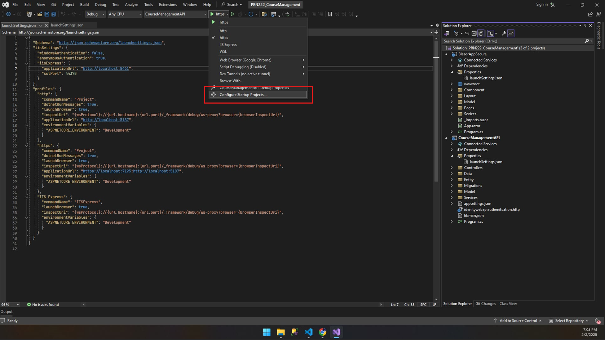
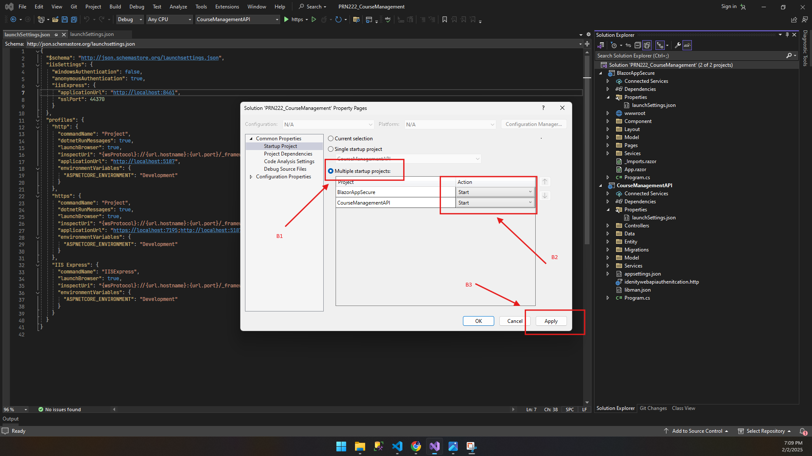
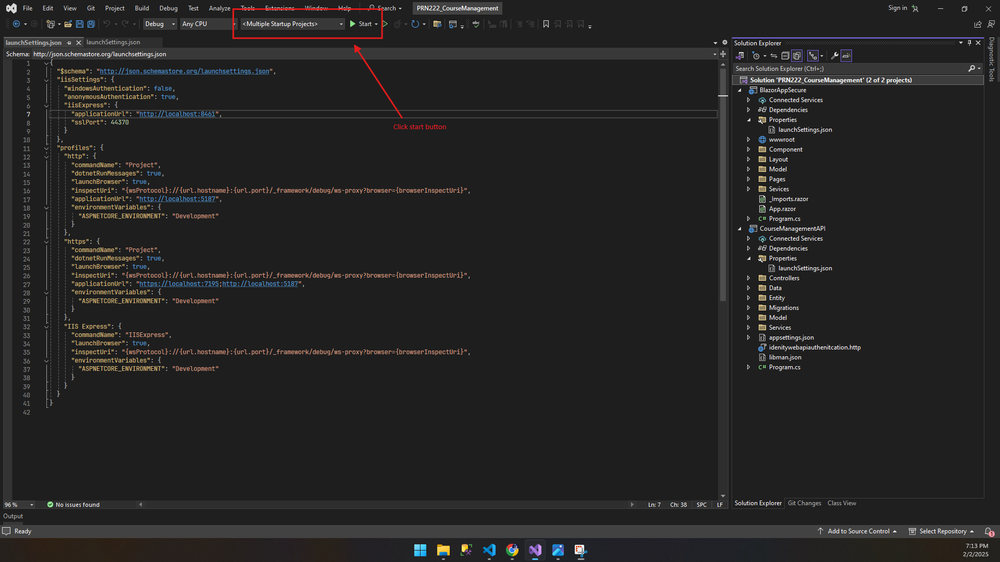

## Hướng dẫn chạy UI và API cùng lúc trong Visual Studio





## Lỗi khi chạy Blazor app

1. Install the required .NET workloads:

```bash
# Restore all required workloads
dotnet workload restore

# If above command doesn't work, try installing specific workloads:
dotnet workload install wasm-tools
dotnet workload install wasm-tools-net8
```

## Hướng dẫn chạy UI và API cùng lúc trong Visual Studio Code

## Giới thiệu project

Course Management là hệ thống quản lý học trực tuyến xây dựng bằng .NET 8. Project gồm ASP.NET Core Web API, Blazor WebAssembly và SQL Server, hỗ trợ các chức năng chính:

- Đăng ký, xác nhận email, đăng nhập bằng ASP.NET Core Identity Cookie.
- Phân quyền `Admin` và `User`.
- Quản lý category, khóa học, module, bài học và tài liệu.
- Ghi danh khóa học, theo dõi bài đã hoàn thành, bài xem gần nhất và ghi chú.
- Quản lý blog và bình luận thời gian thực bằng SignalR.
- Lưu trữ file bằng MinIO.
- Đăng ký tài khoản Premium và thanh toán qua VNPay Sandbox.

Tài liệu giải thích chi tiết code được đặt tại:

```text
..\..\Ly_thuyet\Giai_thich_Project_CourseManagement.md
```

## Kiến trúc solution

```text
PRN222_CourseManagement.sln
├── CourseManagement.Model       # Entity, DTO, ViewModel, enum và response model
├── CourseManagement.DataAccess  # DbContext, migrations, repository và Unit of Work
├── CourseManagement.Business    # User/role, email, VNPay, MinIO và business service
├── CourseManagementAPI          # ASP.NET Core Web API, Identity, Swagger và SignalR
├── BlazorAppSecure              # Blazor WebAssembly frontend
└── tools                        # Công cụ import playlist YouTube và tạo user VIP
```

Luồng gọi code phổ biến:

```text
Blazor UI -> HTTP API Controller -> Service/Repository -> EF Core -> SQL Server
```

## Yêu cầu môi trường

- .NET SDK 8.x.
- SQL Server 2022 hoặc SQL Server tương thích.
- Docker Desktop nếu chạy SQL Server và MinIO bằng Docker Compose.
- Chứng chỉ HTTPS development cho ASP.NET Core.
- Visual Studio 2022 hoặc Visual Studio Code.

Kiểm tra SDK:

```powershell
dotnet --version
dotnet workload restore
```

Nếu máy chưa tin cậy chứng chỉ development:

```powershell
dotnet dev-certs https --trust
```

## Cấu hình bắt buộc

### 1. SQL Server

Sửa `ConnectionStrings:DBContext` trong `CourseManagementAPI/appsettings.json`:

```json
"ConnectionStrings": {
  "DBContext": "Server=localhost,1433;Database=CourseManagement;User Id=sa;Password=YourStrong@Passw0rd;TrustServerCertificate=True;Encrypt=False;MultipleActiveResultSets=True"
}
```

Connection string trên phù hợp với thông tin mẫu trong `docker-compose.yml`. Nếu dùng SQL Server cài trực tiếp trên Windows, hãy thay server instance và tài khoản cho đúng máy.

API tự gọi `Database.Migrate()` khi khởi động. Vì vậy SQL Server phải chạy và connection string phải hợp lệ trước khi chạy API.

### 2. Email SMTP

Điền cấu hình trong `CourseManagementAPI/appsettings.json` để sử dụng xác nhận email và quên mật khẩu:

```json
"EmailSettings": {
  "Mail": "your-email@example.com",
  "DisplayName": "ELearning - Authentication",
  "Password": "YOUR_EMAIL_APP_PASSWORD",
  "Host": "smtp.gmail.com",
  "Port": 587
}
```

Nếu dùng Gmail, `Password` phải là App Password. Không commit email password thật lên Git; nên dùng .NET User Secrets hoặc environment variables.

### 3. VNPay Sandbox

Điền `TmnCode` và `HashSecret` do VNPay Sandbox cấp:

```json
"VnPay": {
  "TmnCode": "YOUR_TMN_CODE",
  "HashSecret": "YOUR_VNPAY_HASH_SECRET",
  "BaseUrl": "https://sandbox.vnpayment.vn/paymentv2/vpcpay.html",
  "PaymentBackReturnUrl": "https://localhost:7239/api/Payment/callback"
}
```

Callback và URL frontend hiện dùng cổng development mặc định. Nếu đổi cổng, cần cập nhật đồng bộ các URL liên quan.

### 4. URL frontend/backend

Backend sử dụng:

```text
https://localhost:7239
```

Frontend sử dụng một trong hai địa chỉ:

```text
https://localhost:7195
http://localhost:5187
```

Kiểm tra các giá trị `BackendUrl` và `FrontendUrl` trong:

- `CourseManagementAPI/appsettings.json`.
- `BlazorAppSecure/wwwroot/appsettings.json`.

Authentication sử dụng cookie, vì vậy frontend origin phải nằm trong CORS policy của API và request phải gửi kèm browser credentials.

## Khởi động SQL Server và MinIO bằng Docker

Tại thư mục chứa `docker-compose.yml`, chạy:

```powershell
docker compose up -d
docker compose ps
```

Các dịch vụ mặc định:

| Dịch vụ | Địa chỉ | Thông tin mẫu |
|---|---|---|
| SQL Server | `localhost:1433` | user `sa`, password trong `docker-compose.yml` |
| MinIO API | `http://localhost:9000` | `minioadmin/minioadmin` |
| MinIO Console | `http://localhost:9001` | `minioadmin/minioadmin` |

Sau khi MinIO chạy, mở `http://localhost:9001` và tạo bucket có tên chính xác là:

```text
file
```

Nếu chưa có bucket này, chức năng upload tài liệu sẽ thất bại.

## Restore và build

Tại thư mục gốc của repository:

```powershell
dotnet restore PRN222_CourseManagement.sln
dotnet build PRN222_CourseManagement.sln --no-restore
```

## Chạy bằng Visual Studio Code hoặc terminal

Mở hai terminal tại thư mục project.

Terminal 1 - chạy API:

```powershell
dotnet run --project CourseManagementAPI
```

Terminal 2 - chạy Blazor UI:

```powershell
dotnet run --project BlazorAppSecure
```

Sau khi chạy:

- Swagger: `https://localhost:7239/swagger`.
- Blazor UI: `https://localhost:7195` hoặc `http://localhost:5187`.
- SignalR Hub: `https://localhost:7239/commentHub`.

Swagger chỉ được bật trong môi trường `Development`.

## Database migration và dữ liệu mẫu

API tự apply migration khi khởi động:

```csharp
dbContext.Database.Migrate();
```

`CourseManagementAPI/Program.cs` cũng seed category, blog và các khóa học lập trình mẫu. Playlist video được đọc từ:

```text
CourseManagementAPI/Data/youtube-playlists.json
```

Không nên xóa hoặc đổi cấu trúc file này nếu vẫn muốn đồng bộ dữ liệu khóa học mẫu khi API start.

Nếu cần tạo migration mới:

```powershell
dotnet ef migrations add <MigrationName> --project CourseManagement.DataAccess --startup-project CourseManagementAPI
dotnet ef database update --project CourseManagement.DataAccess --startup-project CourseManagementAPI
```

## Các route quan trọng

| Chức năng | Route |
|---|---|
| Swagger API | `/swagger` |
| Đăng nhập | `/login` |
| Đăng ký | `/register` |
| Danh sách khóa học | `/courses` |
| Xem trước khóa học | `/preview/{courseId}` |
| Học khóa học | `/learning/{courseId}` |
| Blog | `/listBlog` |
| Đăng ký Premium | `/vip-subscription` |
| Quản lý user | `/users` |
| Quản lý đơn hàng | `/orders` |

## Role và quyền truy cập

- `User`: xem nội dung, ghi danh, học, ghi chú, bình luận và mua Premium.
- `Admin`: quản lý user/role, category, course, module, lesson, tài liệu, blog và order.
- Khóa học `ProCourse` yêu cầu tài khoản có `VipStatus.Premium` và `VipExpirationDate` còn hạn.

Người dùng đăng ký qua API custom được gán role `User`. Để sử dụng trang quản trị, tài khoản phải được gán role `Admin` trong database hoặc qua chức năng quản lý role của hệ thống.

## Xử lý lỗi thường gặp

### Không kết nối được database

- Kiểm tra container SQL Server bằng `docker compose ps`.
- Kiểm tra port `1433`, tên database, username và password.
- Bảo đảm password SQL Server đáp ứng password policy.
- Kiểm tra `TrustServerCertificate=True` khi chạy local.

### API dừng khi khởi động

API chạy migration và seed ngay lúc start. Hãy đọc exception đầu tiên trong console; nguyên nhân thường là SQL Server chưa sẵn sàng, sai connection string hoặc migration lỗi.

### Blazor bị chuyển về trang login

- Kiểm tra API đang chạy đúng `BackendUrl`.
- Mở cả frontend và backend bằng HTTPS hoặc cấu hình URL nhất quán.
- Kiểm tra chứng chỉ development và CORS origin.
- Xóa cookie localhost cũ rồi đăng nhập lại.

### Upload file thất bại

- Kiểm tra MinIO ở port `9000`.
- Kiểm tra bucket `file` đã được tạo.
- Kiểm tra credential MinIO trong `MinioFileService` khớp với Docker Compose.

### Không nhận bình luận realtime

- Kiểm tra kết nối tới `/commentHub`.
- Kiểm tra URL SignalR trong `BlazorAppSecure/Program.cs` nếu đã đổi port API.
- Bảo đảm WebSocket không bị proxy hoặc firewall chặn.

### Email không gửi được

- Dùng Gmail App Password thay vì mật khẩu Gmail thông thường.
- Kiểm tra SMTP host `smtp.gmail.com`, port `587` và kết nối mạng.

## Lưu ý bảo mật trước khi deploy

- Không để DB password, SMTP password, VNPay secret hoặc MinIO credential thật trong source code.
- Xác minh chữ ký VNPay callback trước khi cập nhật Order hoặc cấp Premium.
- Rà soát và thêm `[Authorize]`/role phù hợp cho các API tạo order, cập nhật order, comment và file.
- Đổi credential MinIO mặc định.
- Chỉ cho phép CORS từ domain frontend thật.
- Cập nhật các NuGet package có security advisory trước khi triển khai production.

## Trạng thái build đã kiểm tra

Solution đã được restore và build thành công với:

```text
0 error
491 warning
```

Warning hiện chủ yếu liên quan nullable reference, field chưa dùng và security advisory của một số package. Build thành công không thay thế việc kiểm thử runtime với SQL Server, MinIO, SMTP và VNPay.
